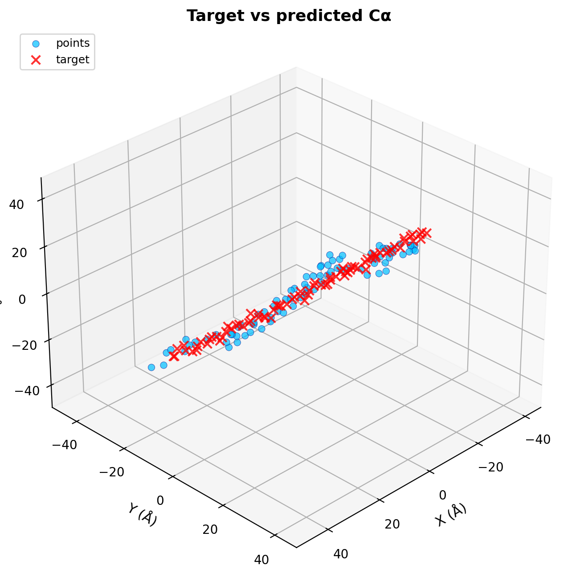
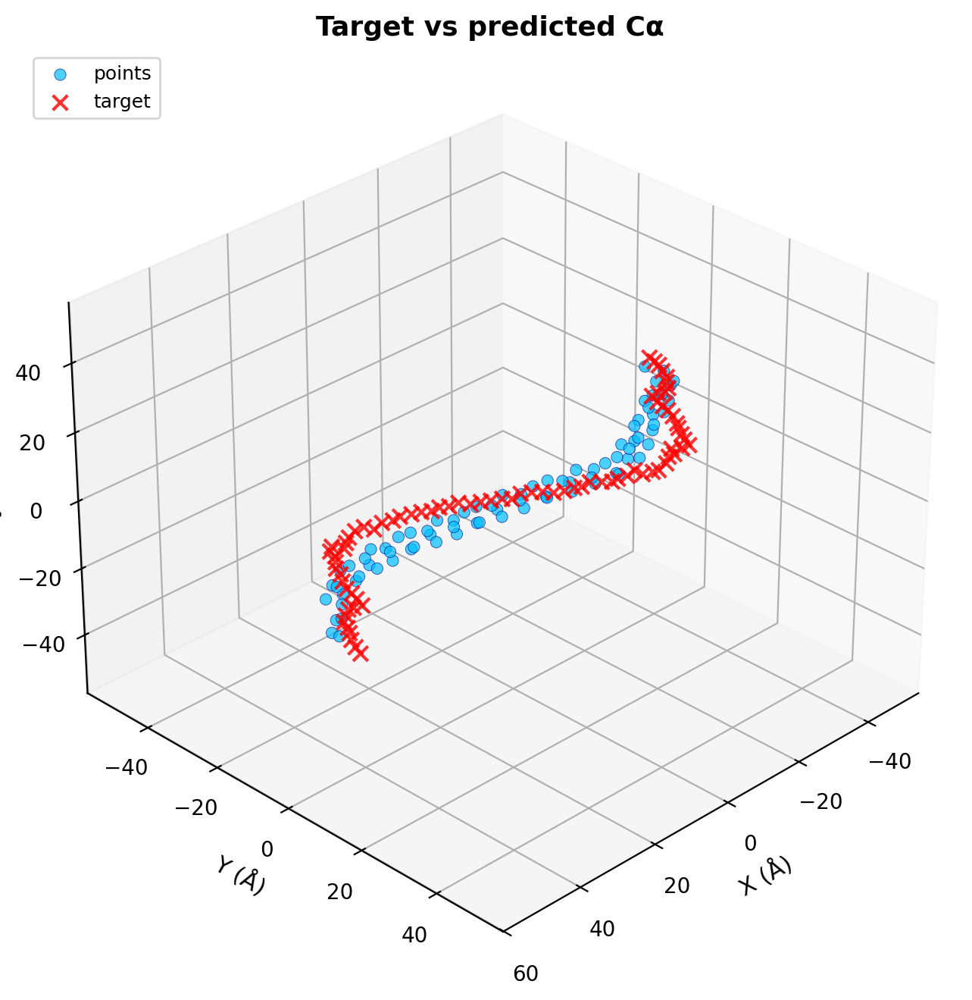
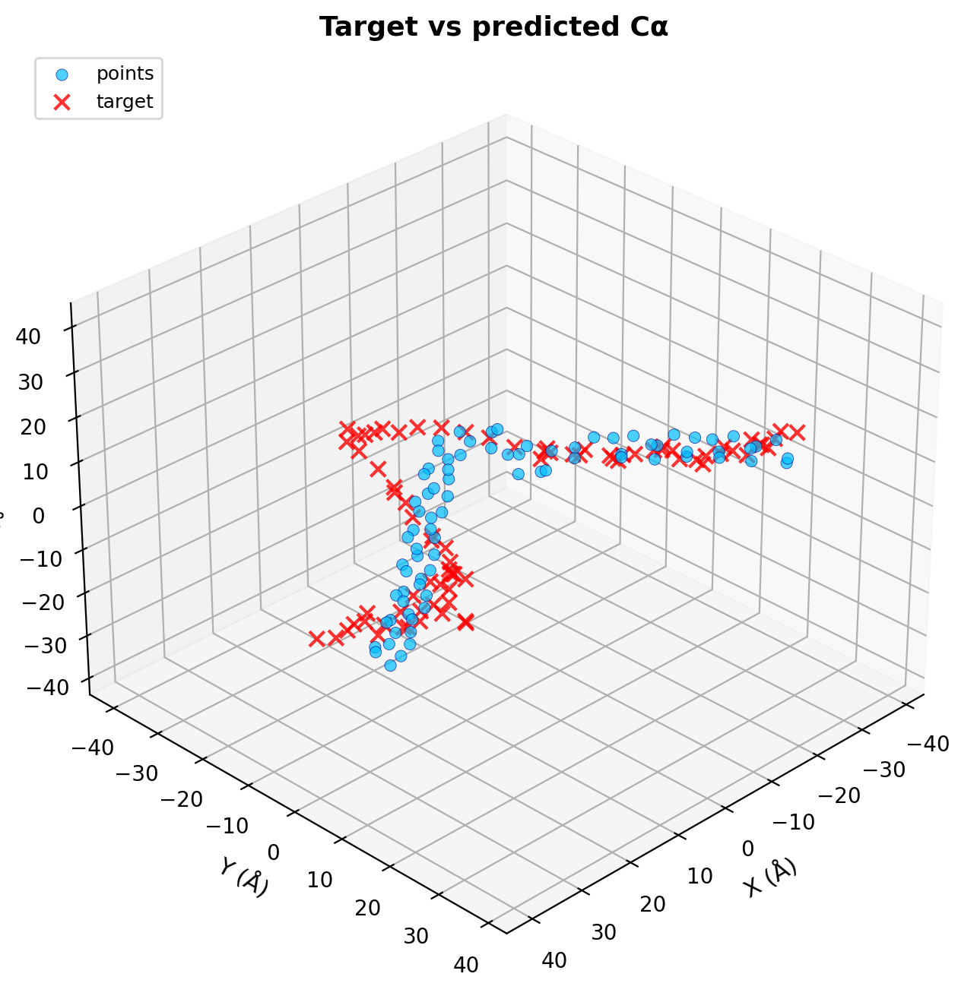

# ColabDesign STL Extension

Design proteins to approximate arbitrary STL shapes by integrating custom shape losses into [ColabDesign](https://github.com/sokrypton/ColabDesign). This extension adds STL → point-cloud preprocessing, centerline extraction for tube-like shapes, and a per-index path loss for ordered targets.

[](https://colab.research.google.com/github/ib565/colabdesign-stl/blob/master/examples/colab_stl_notebook.ipynb)

## Examples

Protein designs for three tube-like STL shapes are shown below:

### Cylinder
A straight cylindrical tube.



### Sine Tube
A tube following a sine-wave path.



### Helix Tube
A helical tube with one complete turn.



**Metrics:** See `results/metrics.csv` for quantitative results.

## Results

Quantitative metrics for the three example shapes:

| Shape | Path Loss (Ų) | pLDDT | PAE |
|-------|----------------|-------|-----|
| Cylinder | 39.38 | 0.60 | 0.57 |
| Sine Tube | 58.81 | 0.79 | 0.53 |
| Helix Tube | 55.05 | 0.79 | 0.57 |

**Settings:** `PROTEIN_LENGTH=80`, `PATH_WEIGHT=0.02`, `SOFT_ITERS=300`, `TEMP_ITERS=150`, `HARD_ITERS=20`

**Trade-off:** There is an emergent trade-off between shape matching (path loss) and structure quality (pLDDT).

## How It Works

1. **STL Processing**: Load STL mesh → sample surface points → extract centerline via PCA + binning
2. **Target Normalization**: Center and scale to target extent (Å)
3. **Path Loss**: Per-index MSE loss between predicted Cα coordinates and target centerline (with Kabsch alignment)
4. **Optimization**: ColabDesign hallucination protocol with custom loss callback


## Quick Start

### Colab (Recommended)

1. **Open the notebook**: Click the "Open In Colab" badge above or [open directly](https://colab.research.google.com/github/ib565/colabdesign-stl/blob/master/examples/colab_stl_notebook.ipynb)
2. **Choose a preset**: Set `PRESET = "stl_centerline_cylinder"` (or `sine_tube`, `helix_tube_1turn`)
3. **Run all cells**: The notebook will clone the repo, install dependencies, and run protein design

**Note:** First run downloads AlphaFold parameters (~3.5GB)

### Local

**Requirements:**
- Python 3.10+
- GPU recommended
- AlphaFold parameters

**Installation:**
```bash
git clone https://github.com/ib565/colabdesign-stl.git
cd colabdesign-stl
python -m venv venv
source venv/bin/activate  # On Windows: venv\Scripts\activate
pip install -r requirements.txt
pip install git+https://github.com/sokrypton/ColabDesign.git
```

**AlphaFold Parameters:**
Download and extract AlphaFold parameters (~3.5GB):
```bash
mkdir params
curl -L -o alphafold_params_2022-12-06.tar https://storage.googleapis.com/alphafold/alphafold_params_2022-12-06.tar
tar -xf alphafold_params_2022-12-06.tar -C params
export AF_DATA_DIR=$(pwd)  # Point to directory containing params/
```

**Run design:**
```bash
python examples/design_from_stl.py \
  --stl cylinder \
  --target-mode centerline \
  --length 80 \
  --target-extent 120.0 \
  --soft-iters 300 --temp-iters 150 --hard-iters 20 \
  --path-weight 0.02 --con 0.2 --plddt 2.0 --pae 0.2 \
  --data-dir . \
  --out-dir outputs/cylinder --plot
```

**Note:** Due to GPU constraints, the full local pipeline has not been run end-to-end; all reported results are from Colab runs.


## Usage

### Notebook (Recommended)
Use `examples/colab_stl_notebook.ipynb` with presets:
- `stl_centerline_cylinder`
- `stl_centerline_sine`
- `stl_centerline_helix1turn`

### Command Line
```bash
python examples/design_from_stl.py --stl <name> --target-mode centerline [options]
```

## Inspection Tools

**Inspect STL files:**
```bash
python scripts/inspect_stl.py cylinder --mode centerline
```

**Build target points independently:**
```bash
python scripts/build_target_points.py --mode stl_centerline --stl-path examples/stl/cylinder.stl
```

**Generate example STLs:**
```bash
python scripts/generate_stls.py
```


## Documentation

- **[DESIGN_NOTES.md](DESIGN_NOTES.md)**: Architecture, design decisions, and technical details
- **[examples/stl/README.md](examples/stl/README.md)**: STL file documentation and generation
- **[results/README.md](results/README.md)**: Results documentation